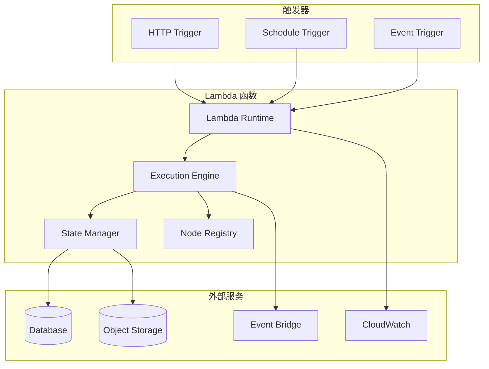

# Hetumind Lambda 函数设计

## 1. Lambda 函数概述

Hetumind Lambda 函数是系统的云原生执行模式，提供无服务器的工作流执行能力。它针对云函数环境进行了优化，支持快速冷启动、状态持久化和弹性扩展。

### 1.1 设计目标

- **快速冷启动**: 优化启动时间，减少冷启动延迟
- **无状态设计**: 函数间无状态依赖，支持水平扩展
- **成本优化**: 按需执行，最小化资源消耗
- **高可用性**: 内置容错和重试机制
- **监控集成**: 完整的可观测性支持

### 1.2 核心特性

- 轻量级运行时，启动时间 < 100ms
- 支持多种触发器（HTTP、定时、事件）
- 内置状态持久化和恢复
- 自动扩缩容和负载均衡
- 完整的错误处理和重试机制

## 2. Lambda 架构设计

### 2.1 函数架构



### 2.2 Lambda 运行时

```rust
use lambda_runtime::{service_fn, Error, LambdaEvent};
use serde::{Deserialize, Serialize};
use tokio::sync::OnceCell;

// 全局状态，用于复用连接和缓存
static LAMBDA_CONTEXT: OnceCell<LambdaContext> = OnceCell::const_new();

#[derive(Debug, Clone)]
pub struct LambdaContext {
    pub db_pool: Arc<PgPool>,
    pub node_registry: Arc<NodeRegistry>,
    pub execution_engine: Arc<LambdaExecutionEngine>,
    pub state_manager: Arc<StateManager>,
    pub config: LambdaConfig,
}

#[derive(Debug, Clone, Serialize, Deserialize)]
pub struct LambdaConfig {
    pub database_url: String,
    pub s3_bucket: String,
    pub max_execution_time: u64,
    pub memory_limit: u64,
    pub enable_tracing: bool,
}

#[tokio::main]
async fn main() -> Result<(), Error> {
    // 初始化日志
    tracing_subscriber::init();

    // 初始化 Lambda 上下文
    let context = initialize_lambda_context().await?;
    LAMBDA_CONTEXT.set(context).map_err(|_| "Failed to set lambda context")?;

    // 启动 Lambda 运行时
    lambda_runtime::run(service_fn(function_handler)).await
}

async fn initialize_lambda_context() -> Result<LambdaContext, Error> {
    let config = load_lambda_config().await?;

    // 创建数据库连接池
    let db_pool = Arc::new(
        PgPool::connect(&config.database_url)
            .await
            .map_err(|e| format!("Database connection failed: {}", e))?
    );

    // 初始化节点注册表
    let node_registry = Arc::new(NodeRegistry::new());
    register_core_nodes(&node_registry).await?;

    // 创建状态管理器
    let state_manager = Arc::new(
        StateManager::new(db_pool.clone(), config.s3_bucket.clone()).await?
    );

    // 创建执行引擎
    let execution_engine = Arc::new(
        LambdaExecutionEngine::new(
            node_registry.clone(),
            state_manager.clone(),
            config.clone(),
        )
    );

    Ok(LambdaContext {
        db_pool,
        node_registry,
        execution_engine,
        state_manager,
        config,
    })
}

async fn function_handler(event: LambdaEvent<LambdaRequest>) -> Result<LambdaResponse, Error> {
    let context = LAMBDA_CONTEXT.get()
        .ok_or("Lambda context not initialized")?;

    let start_time = std::time::Instant::now();

    // 处理请求
    let result = match event.payload.request_type {
        RequestType::ExecuteWorkflow => {
            handle_workflow_execution(context, event.payload).await
        }
        RequestType::ExecuteNode => {
            handle_node_execution(context, event.payload).await
        }
        RequestType::ResumeExecution => {
            handle_execution_resume(context, event.payload).await
        }
    };

    let duration = start_time.elapsed();

    // 记录指标
    record_execution_metrics(&event.context, duration, &result).await;

    result
}
```

### 2.3 请求和响应类型

```rust
#[derive(Debug, Serialize, Deserialize)]
pub struct LambdaRequest {
    pub request_type: RequestType,
    pub execution_id: Option<ExecutionId>,
    pub workflow_id: Option<WorkflowId>,
    pub node_name: Option<NodeId>,
    pub input_data: Option<Vec<ExecutionData>>,
    pub context: ExecutionContext,
    pub metadata: HashMap<String, serde_json::Value>,
}

#[derive(Debug, Serialize, Deserialize)]
#[serde(rename_all = "snake_case")]
pub enum RequestType {
    ExecuteWorkflow,
    ExecuteNode,
    ResumeExecution,
}

#[derive(Debug, Serialize, Deserialize)]
pub struct LambdaResponse {
    pub success: bool,
    pub execution_id: ExecutionId,
    pub status: ExecutionStatus,
    pub output_data: Option<Vec<ExecutionData>>,
    pub error: Option<String>,
    pub next_action: Option<NextAction>,
    pub metadata: HashMap<String, serde_json::Value>,
}

#[derive(Debug, Serialize, Deserialize)]
#[serde(rename_all = "snake_case")]
pub enum NextAction {
    Continue { next_nodes: Vec<NodeId> },
    Wait { resume_at: OffsetDateTime },
    Complete,
    Failed { error: String },
}
```

## 3. Lambda 执行引擎

### 3.1 执行引擎实现

```rust
pub struct LambdaExecutionEngine {
    node_registry: Arc<NodeRegistry>,
    state_manager: Arc<StateManager>,
    config: LambdaConfig,
    metrics_collector: Arc<MetricsCollector>,
}

impl LambdaExecutionEngine {
    pub async fn execute_workflow(
        &self,
        request: LambdaRequest,
    ) -> Result<LambdaResponse, LambdaError> {
        let execution_id = request.execution_id
            .unwrap_or_else(|| Uuid::now_v7());

        // 加载或创建执行状态
        let mut execution_state = match self.state_manager
            .load_execution_state(execution_id).await? {
            Some(state) => state,
            None => {
                // 新的执行，加载工作流定义
                let workflow = self.load_workflow(request.workflow_id.unwrap()).await?;
                ExecutionState::new(execution_id, workflow)
            }
        };

        // 执行当前批次的节点
        let execution_result = self.execute_batch(
            &mut execution_state,
            &request.context,
        ).await?;

        // 保存执行状态
        self.state_manager.save_execution_state(&execution_state).await?;

        // 确定下一步动作
        let next_action = self.determine_next_action(&execution_state)?;

        Ok(LambdaResponse {
            success: execution_result.success,
            execution_id,
            status: execution_state.status,
            output_data: execution_result.output_data,
            error: execution_result.error,
            next_action: Some(next_action),
            metadata: execution_result.metadata,
        })
    }

    async fn execute_batch(
        &self,
        execution_state: &mut ExecutionState,
        context: &ExecutionContext,
    ) -> Result<BatchExecutionResult, LambdaError> {
        let start_time = std::time::Instant::now();
        let max_execution_time = Duration::from_secs(self.config.max_execution_time);

        let mut results = Vec::new();
        let mut pending_nodes = execution_state.get_ready_nodes();

        while !pending_nodes.is_empty() && start_time.elapsed() < max_execution_time {
            let batch_start = std::time::Instant::now();

            // 并发执行当前批次的节点
            let tasks: Vec<_> = pending_nodes.into_iter()
                .take(self.get_batch_size())
                .map(|node_name| {
                    let node = execution_state.get_node(node_name).unwrap().clone();
                    self.execute_node(node, context, execution_state)
                })
                .collect();

            let batch_results = futures::future::join_all(tasks).await;

            // 处理批次结果
            for result in batch_results {
                match result {
                    Ok(node_result) => {
                        execution_state.update_node_result(node_result.clone());
                        results.push(node_result);
                    }
                    Err(e) => {
                        execution_state.mark_failed(e.to_string());
                        return Ok(BatchExecutionResult {
                            success: false,
                            output_data: None,
                            error: Some(e.to_string()),
                            metadata: HashMap::default(),
                        });
                    }
                }
            }

            // 获取下一批次的节点
            pending_nodes = execution_state.get_ready_nodes();

            // 检查是否需要等待外部事件
            if execution_state.has_waiting_nodes() {
                break;
            }
        }

        // 检查执行是否完成
        if execution_state.is_completed() {
            execution_state.mark_completed();
        } else if start_time.elapsed() >= max_execution_time {
            // 超时，需要继续执行
            execution_state.mark_suspended();
        }

        Ok(BatchExecutionResult {
            success: true,
            output_data: Some(self.collect_output_data(&results)),
            error: None,
            metadata: self.collect_execution_metadata(&results),
        })
    }

    async fn execute_node(
        &self,
        node: Node,
        context: &ExecutionContext,
        execution_state: &ExecutionState,
    ) -> Result<NodeExecutionResult, LambdaError> {
        let start_time = std::time::Instant::now();

        // 获取节点执行器
        let executor = self.node_registry.get_executor(&node.kind)
            .ok_or_else(|| LambdaError::UnknownNodeType(node.kind.clone()))?;

        // 准备输入数据
        let input_data = execution_state.get_node_input_data(node.id)?;

        // 创建节点执行上下文
        let node_context = ExecutionContext {
            current_node_id: node.id,
            input_data,
            ..context.clone()
        };

        // 执行节点
        let result = executor.execute(&node_context, &node).await
            .map_err(|e| LambdaError::NodeExecutionError {
                node_name: node.id,
                error: e.to_string(),
            })?;

        let duration = start_time.elapsed();

        // 记录节点执行指标
        self.metrics_collector.record_node_execution(
            node.id,
            &node.kind,
            duration,
            result.len(),
        ).await;

        Ok(NodeExecutionResult {
            node_name: node.id,
            status: ExecutionStatus::Success,
            started_at: node_context.started_at,
            finished_at: Some(now_offset()),
            duration: Some(duration),
            input_data: node_context.input_data,
            output_data: result,
            error: None,
        })
    }

    fn determine_next_action(
        &self,
        execution_state: &ExecutionState,
    ) -> Result<NextAction, LambdaError> {
        match execution_state.status {
            ExecutionStatus::Success => Ok(NextAction::Complete),
            ExecutionStatus::Failed => Ok(NextAction::Failed {
                error: execution_state.error.clone().unwrap_or_default(),
            }),
            ExecutionStatus::Waiting => {
                // 检查是否有等待的节点
                if let Some(wait_until) = execution_state.get_earliest_resume_time() {
                    Ok(NextAction::Wait { resume_at: wait_until })
                } else {
                    Ok(NextAction::Continue {
                        next_nodes: execution_state.get_ready_nodes(),
                    })
                }
            }
            ExecutionStatus::Running => Ok(NextAction::Continue {
                next_nodes: execution_state.get_ready_nodes(),
            }),
            _ => Ok(NextAction::Continue {
                next_nodes: vec![],
            }),
        }
    }
}
```

## 4. 状态管理

### 4.1 状态管理器

```rust
use aws_sdk_s3::Client as S3Client;

pub struct StateManager {
    db_pool: Arc<PgPool>,
    s3_client: S3Client,
    bucket_name: String,
}

impl StateManager {
    pub async fn new(
        db_pool: Arc<PgPool>,
        bucket_name: String,
    ) -> Result<Self, StateManagerError> {
        let config = aws_config::load_from_env().await;
        let s3_client = S3Client::new(&config);

        Ok(Self {
            db_pool,
            s3_client,
            bucket_name,
        })
    }

    pub async fn save_execution_state(
        &self,
        execution_state: &ExecutionState,
    ) -> Result<(), StateManagerError> {
        // 序列化状态
        let state_data = serde_json::to_vec(execution_state)?;

        // 保存到 S3
        let key = format!("executions/{}/state.json", execution_state.execution_id);
        self.s3_client
            .put_object()
            .bucket(&self.bucket_name)
            .key(&key)
            .body(state_data.into())
            .content_type("application/json")
            .send()
            .await?;

        // 更新数据库中的执行记录
        let execution_repo = ExecutionRepository::new(self.db_pool.clone());
        execution_repo.update_execution_status(
            execution_state.execution_id,
            execution_state.status,
            execution_state.error.clone(),
        ).await?;

        Ok(())
    }

    pub async fn load_execution_state(
        &self,
        execution_id: ExecutionId,
    ) -> Result<Option<ExecutionState>, StateManagerError> {
        let key = format!("executions/{}/state.json", execution_id);

        match self.s3_client
            .get_object()
            .bucket(&self.bucket_name)
            .key(&key)
            .send()
            .await {
            Ok(response) => {
                let body = response.body.collect().await?;
                let state: ExecutionState = serde_json::from_slice(&body.into_bytes())?;
                Ok(Some(state))
            }
            Err(aws_sdk_s3::error::SdkError::ServiceError(service_err))
                if service_err.err().is_no_such_key() => {
                Ok(None)
            }
            Err(e) => Err(StateManagerError::S3Error(e.to_string())),
        }
    }

    pub async fn cleanup_execution_state(
        &self,
        execution_id: ExecutionId,
    ) -> Result<(), StateManagerError> {
        let key = format!("executions/{}/state.json", execution_id);

        self.s3_client
            .delete_object()
            .bucket(&self.bucket_name)
            .key(&key)
            .send()
            .await?;

        Ok(())
    }
}
```

### 4.2 执行状态

```rust
#[derive(Debug, Clone, Serialize, Deserialize)]
pub struct ExecutionState {
    pub execution_id: ExecutionId,
    pub workflow_id: WorkflowId,
    pub status: ExecutionStatus,
    pub started_at: OffsetDateTime,
    pub finished_at: Option<OffsetDateTime>,
    pub error: Option<String>,

    /// 工作流定义
    pub workflow: Workflow,

    /// 节点执行状态
    pub node_states: HashMap<NodeId, NodeState>,

    /// 节点执行结果
    pub node_results: HashMap<NodeId, NodeExecutionResult>,

    /// 等待的节点和恢复时间
    pub waiting_nodes: HashMap<NodeId, OffsetDateTime>,

    /// 执行上下文
    pub context: ExecutionContext,
}

#[derive(Debug, Clone, Serialize, Deserialize)]
pub enum NodeState {
    Pending,
    Ready,
    Running,
    Completed,
    Failed,
    Waiting { resume_at: OffsetDateTime },
    Skipped,
}

impl ExecutionState {
    pub fn new(execution_id: ExecutionId, workflow: Workflow) -> Self {
        let mut node_states = HashMap::default();

        // 初始化所有节点状态
        for node in &workflow.nodes {
            node_states.insert(node.id, NodeState::Pending);
        }

        // 标记起始节点为就绪状态
        let start_nodes = Self::find_start_nodes(&workflow);
        for node_name in start_nodes {
            node_states.insert(node_name, NodeState::Ready);
        }

        Self {
            execution_id,
            workflow_id: workflow.id,
            status: ExecutionStatus::Running,
            started_at: now_offset(),
            finished_at: None,
            error: None,
            workflow,
            node_states,
            node_results: HashMap::default(),
            waiting_nodes: HashMap::default(),
            context: ExecutionContext::default(),
        }
    }

    pub fn get_ready_nodes(&self) -> Vec<NodeId> {
        self.node_states
            .iter()
            .filter_map(|(node_name, state)| {
                match state {
                    NodeState::Ready => Some(*node_name),
                    _ => None,
                }
            })
            .collect()
    }

    pub fn update_node_result(&mut self, result: NodeExecutionResult) {
        self.node_results.insert(result.node_name, result.clone());

        match result.status {
            ExecutionStatus::Success => {
                self.node_states.insert(result.node_name, NodeState::Completed);
                self.update_dependent_nodes(result.node_name);
            }
            ExecutionStatus::Failed => {
                self.node_states.insert(result.node_name, NodeState::Failed);
                self.mark_failed(result.error.unwrap_or_default());
            }
            ExecutionStatus::Waiting => {
                // 节点需要等待，设置恢复时间
                if let Some(resume_at) = self.calculate_resume_time(&result) {
                    self.node_states.insert(result.node_name, NodeState::Waiting { resume_at });
                    self.waiting_nodes.insert(result.node_name, resume_at);
                }
            }
            _ => {}
        }
    }

    fn update_dependent_nodes(&mut self, completed_node_id: NodeId) {
        // 查找依赖于已完成节点的节点
        let dependent_nodes: Vec<NodeId> = self.workflow.connections
            .iter()
            .filter(|conn| conn.source_node_id == completed_node_id)
            .map(|conn| conn.target_node_id)
            .collect();

        for node_name in dependent_nodes {
            // 检查该节点的所有依赖是否都已完成
            if self.are_dependencies_satisfied(node_name) {
                self.node_states.insert(node_name, NodeState::Ready);
            }
        }
    }

    fn are_dependencies_satisfied(&self, node_name: NodeId) -> bool {
        let dependencies: Vec<NodeId> = self.workflow.connections
            .iter()
            .filter(|conn| conn.target_node_id == node_name)
            .map(|conn| conn.source_node_id)
            .collect();

        dependencies.iter().all(|dep_id| {
            matches!(
                self.node_states.get(dep_id),
                Some(NodeState::Completed)
            )
        })
    }

    pub fn is_completed(&self) -> bool {
        self.node_states.values().all(|state| {
            matches!(state, NodeState::Completed | NodeState::Skipped | NodeState::Failed)
        }) && self.waiting_nodes.is_empty()
    }

    pub fn has_waiting_nodes(&self) -> bool {
        !self.waiting_nodes.is_empty()
    }

    pub fn get_earliest_resume_time(&self) -> Option<OffsetDateTime> {
        self.waiting_nodes.values().min().copied()
    }

    pub fn mark_completed(&mut self) {
        self.status = ExecutionStatus::Success;
        self.finished_at = Some(now_offset());
    }

    pub fn mark_failed(&mut self, error: String) {
        self.status = ExecutionStatus::Failed;
        self.error = Some(error);
        self.finished_at = Some(now_offset());
    }

    pub fn mark_suspended(&mut self) {
        self.status = ExecutionStatus::Waiting;
    }
}
```

## 5. 冷启动优化

### 5.1 启动优化策略

```rust
use std::sync::LazyLock;

// 使用 LazyLock 进行延迟初始化
static NODE_REGISTRY: LazyLock<NodeRegistry> = LazyLock::new(|| {
    let mut registry = NodeRegistry::new();

    // 只注册核心节点，减少启动时间
    registry.register_core_nodes();

    registry
});

// 预编译的正则表达式
static EMAIL_REGEX: LazyLock<regex::Regex> = LazyLock::new(|| {
    regex::Regex::new(r"^[a-zA-Z0-9._%+-]+@[a-zA-Z0-9.-]+\.[a-zA-Z]{2,}$").unwrap()
});

// 连接池复用
static DB_POOL: LazyLock<Option<PgPool>> = LazyLock::new(|| {
    // 在第一次调用时创建连接池
    None
});

pub struct ColdStartOptimizer;

impl ColdStartOptimizer {
    /// 预热函数，在容器启动时调用
    pub async fn warmup() -> Result<(), Error> {
        // 预加载配置
        let _config = load_lambda_config().await?;

        // 预初始化节点注册表
        let _registry = &*NODE_REGISTRY;

        // 预编译正则表达式
        let _regex = &*EMAIL_REGEX;

        // 预分配内存池
        Self::preallocate_memory();

        Ok(())
    }

    fn preallocate_memory() {
        // 预分配一些常用的数据结构
        let _vec: Vec<u8> = Vec::with_capacity(1024 * 1024); // 1MB
        let _map: HashMap<String, String> = HashMap::with_capacity(100);
    }

    /// 获取或创建数据库连接池
    pub async fn get_db_pool() -> Result<Arc<PgPool>, Error> {
        static POOL_INIT: std::sync::Once = std::sync::Once::new();
        static mut POOL: Option<Arc<PgPool>> = None;

        unsafe {
            POOL_INIT.call_once(|| {
                // 在运行时初始化连接池
                let rt = tokio::runtime::Handle::current();
                let pool = rt.block_on(async {
                    let config = load_lambda_config().await.unwrap();
                    PgPool::connect(&config.database_url).await.unwrap()
                });
                POOL = Some(Arc::new(pool));
            });

            Ok(POOL.as_ref().unwrap().clone())
        }
    }
}
```

### 5.2 内存优化

```rust
use std::alloc::{GlobalAlloc, Layout};

// 自定义内存分配器，优化小对象分配
pub struct OptimizedAllocator;

unsafe impl GlobalAlloc for OptimizedAllocator {
    unsafe fn alloc(&self, layout: Layout) -> *mut u8 {
        // 对于小对象使用对象池
        if layout.size() <= 1024 {
            SMALL_OBJECT_POOL.alloc(layout)
        } else {
            std::alloc::System.alloc(layout)
        }
    }

    unsafe fn dealloc(&self, ptr: *mut u8, layout: Layout) {
        if layout.size() <= 1024 {
            SMALL_OBJECT_POOL.dealloc(ptr, layout);
        } else {
            std::alloc::System.dealloc(ptr, layout);
        }
    }
}

#[global_allocator]
static GLOBAL: OptimizedAllocator = OptimizedAllocator;

// 对象池实现
struct SmallObjectPool {
    pools: [ObjectPool; 10], // 不同大小的对象池
}

struct ObjectPool {
    free_list: std::sync::Mutex<Vec<*mut u8>>,
    size: usize,
}

static SMALL_OBJECT_POOL: LazyLock<SmallObjectPool> = LazyLock::new(|| {
    SmallObjectPool::new()
});
```

## 6. 监控和可观测性

### 6.1 指标收集

```rust
use aws_sdk_cloudwatch::Client as CloudWatchClient;

pub struct LambdaMetricsCollector {
    cloudwatch_client: CloudWatchClient,
    namespace_id: Uuid,
}

impl LambdaMetricsCollector {
    pub async fn new() -> Self {
        let config = aws_config::load_from_env().await;
        let cloudwatch_client = CloudWatchClient::new(&config);

        Self {
            cloudwatch_client,
            namespace_id: "Hetumind/Lambda".to_string(),
        }
    }

    pub async fn record_execution_metrics(
        &self,
        execution_id: ExecutionId,
        duration: Duration,
        success: bool,
        node_count: usize,
    ) -> Result<(), MetricsError> {
        let timestamp = now_offset();

        // 执行时间指标
        self.put_metric(
            "ExecutionDuration",
            duration.as_millis() as f64,
            "Milliseconds",
            timestamp,
        ).await?;

        // 成功率指标
        self.put_metric(
            "ExecutionSuccess",
            if success { 1.0 } else { 0.0 },
            "Count",
            timestamp,
        ).await?;

        // 节点数量指标
        self.put_metric(
            "NodesExecuted",
            node_count as f64,
            "Count",
            timestamp,
        ).await?;

        Ok(())
    }

    pub async fn record_cold_start(&self, duration: Duration) -> Result<(), MetricsError> {
        self.put_metric(
            "ColdStartDuration",
            duration.as_millis() as f64,
            "Milliseconds",
            now_offset(),
        ).await
    }

    async fn put_metric(
        &self,
        metric_name: &str,
        value: f64,
        unit: &str,
        timestamp: OffsetDateTime,
    ) -> Result<(), MetricsError> {
        use aws_sdk_cloudwatch::types::{MetricDatum, Dimension};

        let metric_data = MetricDatum::builder()
            .metric_name(metric_name)
            .value(value)
            .unit(unit.parse().unwrap())
            .timestamp(timestamp.into())
            .dimensions(
                Dimension::builder()
                    .name("Environment")
                    .value("Production")
                    .build()
                    .unwrap()
            )
            .build()
            .unwrap();

        self.cloudwatch_client
            .put_metric_data()
            .namespace_id(&self.namespace_id)
            .metric_data(metric_data)
            .send()
            .await?;

        Ok(())
    }
}
```

### 6.2 分布式追踪

```rust
use tracing::{info, error, instrument};
use tracing_opentelemetry::OpenTelemetrySpanExt;

#[instrument(skip(context, request))]
pub async fn handle_workflow_execution(
    context: &LambdaContext,
    request: LambdaRequest,
) -> Result<LambdaResponse, Error> {
    let span = tracing::Span::current();

    // 添加追踪属性
    span.set_attribute("execution.id", request.execution_id.unwrap_or_default().to_string());
    span.set_attribute("workflow.id", request.workflow_id.unwrap_or_default().to_string());

    info!("开始执行工作流");

    let result = context.execution_engine
        .execute_workflow(request)
        .await;

    match &result {
        Ok(response) => {
            info!(
                execution_id = %response.execution_id,
                status = ?response.status,
                "工作流执行完成"
            );
        }
        Err(e) => {
            error!(error = %e, "工作流执行失败");
            span.set_attribute("error", true);
        }
    }

    result
}

#[instrument(skip(executor, node, context))]
async fn execute_node_with_tracing(
    executor: Arc<dyn NodeExecutable + Send + Sync>,
    node: Node,
    context: ExecutionContext,
) -> Result<Vec<ExecutionData>, NodeExecutionError> {
    let span = tracing::Span::current();
    span.set_attribute("node.id", node.id.to_string());
    span.set_attribute("node.type", node.kind.clone());
    span.set_attribute("node.name", node.name.clone());

    let start_time = std::time::Instant::now();

    let result = executor.execute(&context, &node).await;

    let duration = start_time.elapsed();
    span.set_attribute("duration_ms", duration.as_millis() as i64);

    match &result {
        Ok(output) => {
            span.set_attribute("output.count", output.len() as i64);
            info!(
                node_name = %node.id,
                node_type = %node.kind,
                duration_ms = duration.as_millis(),
                "节点执行成功"
            );
        }
        Err(e) => {
            span.set_attribute("error", true);
            error!(
                node_name = %node.id,
                node_type = %node.kind,
                error = %e,
                "节点执行失败"
            );
        }
    }

    result
}
```

## 7. 错误处理和重试

### 7.1 错误处理策略

```rust
#[derive(Debug, thiserror::Error)]
pub enum LambdaError {
    #[error("配置错误: {0}")]
    Configuration(String),

    #[error("数据库错误: {0}")]
    Database(#[from] sqlx::Error),

    #[error("状态管理错误: {0}")]
    StateManager(#[from] StateManagerError),

    #[error("节点执行错误 - 节点ID: {node_name}, 错误: {error}")]
    NodeExecutionError { node_name: NodeId, error: String },

    #[error("未知节点类型: {0}")]
    UnknownNodeType(String),

    #[error("执行超时")]
    ExecutionTimeout,

    #[error("内存不足")]
    OutOfMemory,

    #[error("外部服务错误: {service} - {error}")]
    ExternalService { service: String, error: String },
}

impl LambdaError {
    pub fn is_retryable(&self) -> bool {
        match self {
            LambdaError::Database(_) => true,
            LambdaError::StateManager(_) => true,
            LambdaError::ExternalService { .. } => true,
            LambdaError::ExecutionTimeout => false,
            LambdaError::OutOfMemory => false,
            LambdaError::Configuration(_) => false,
            LambdaError::UnknownNodeType(_) => false,
            LambdaError::NodeExecutionError { .. } => false,
        }
    }

    pub fn retry_delay(&self) -> Duration {
        match self {
            LambdaError::Database(_) => Duration::from_secs(1),
            LambdaError::StateManager(_) => Duration::from_secs(2),
            LambdaError::ExternalService { .. } => Duration::from_secs(5),
            _ => Duration::from_secs(0),
        }
    }
}
```

### 7.2 重试机制

```rust
use tokio::time::{sleep, Duration};

pub struct RetryPolicy {
    max_attempts: u32,
    base_delay: Duration,
    max_delay: Duration,
    backoff_multiplier: f64,
}

impl Default for RetryPolicy {
    fn default() -> Self {
        Self {
            max_attempts: 3,
            base_delay: Duration::from_millis(100),
            max_delay: Duration::from_secs(30),
            backoff_multiplier: 2.0,
        }
    }
}

pub async fn retry_with_backoff<F, T, E>(
    operation: F,
    policy: RetryPolicy,
) -> Result<T, E>
where
    F: Fn() -> std::pin::Pin<Box<dyn std::future::Future<Output = Result<T, E>> + Send>>,
    E: std::fmt::Debug,
{
    let mut attempt = 0;
    let mut delay = policy.base_delay;

    loop {
        attempt += 1;

        match operation().await {
            Ok(result) => return Ok(result),
            Err(error) => {
                if attempt >= policy.max_attempts {
                    return Err(error);
                }

                tracing::warn!(
                    attempt = attempt,
                    delay_ms = delay.as_millis(),
                    error = ?error,
                    "操作失败，准备重试"
                );

                sleep(delay).await;

                // 指数退避
                delay = std::cmp::min(
                    Duration::from_millis(
                        (delay.as_millis() as f64 * policy.backoff_multiplier) as u64
                    ),
                    policy.max_delay,
                );
            }
        }
    }
}

// 使用示例
pub async fn execute_with_retry(
    engine: &LambdaExecutionEngine,
    request: LambdaRequest,
) -> Result<LambdaResponse, LambdaError> {
    retry_with_backoff(
        || Box::pin(engine.execute_workflow(request.clone())),
        RetryPolicy::default(),
    ).await
}
```

这个 Lambda 函数设计为 Hetumind 系统提供了高效的云原生执行能力，通过优化冷启动、状态管理和错误处理，确保了在无服务器环境中的高性能和可靠性。
