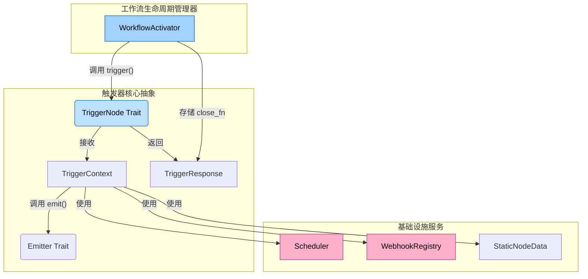
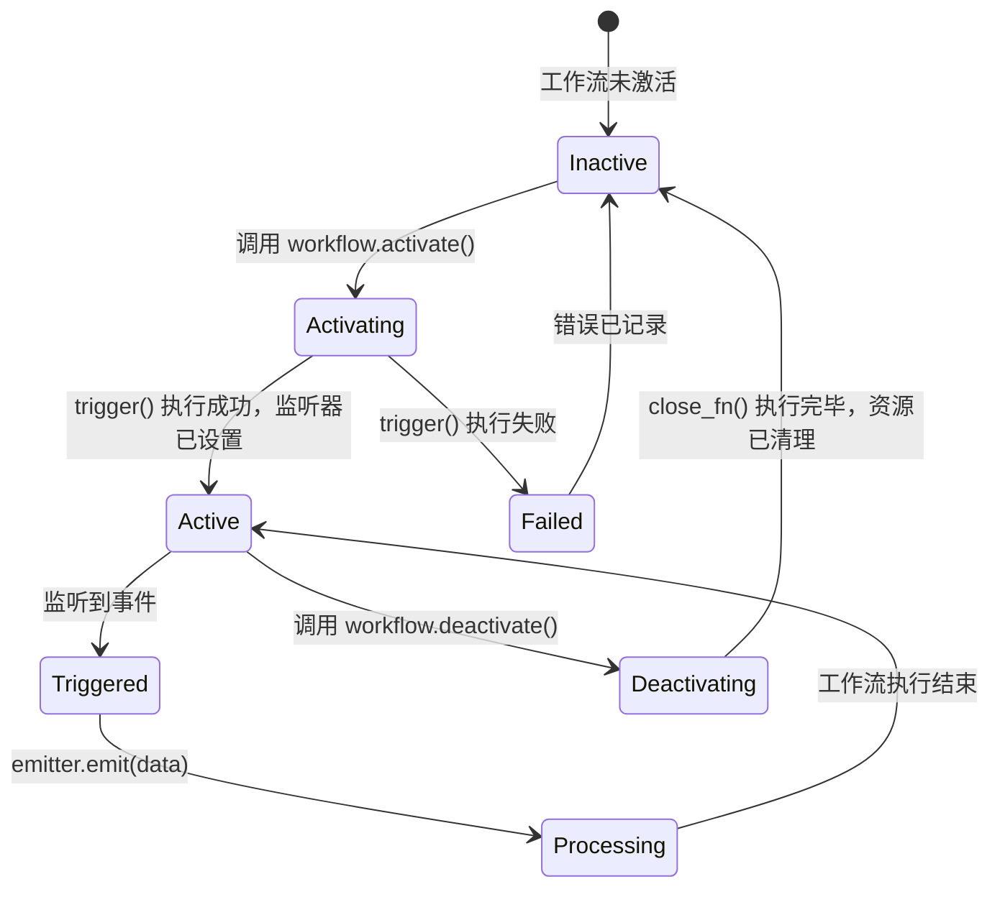
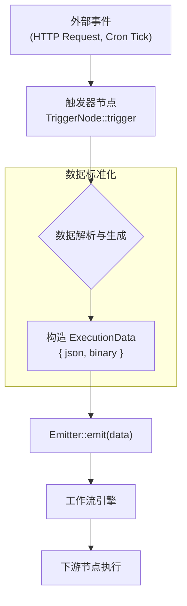

# Hetumind 触发器节点（Trigger Nodes）设计文档

## 1. 核心理念与架构

### 1.1 触发器节点定义

在 Hetumind 工作流引擎中，**触发器节点（Trigger Node）** 是工作流的起点和入口。它负责监听来自外部世界的各种事件——无论是定时的心跳、一个 HTTP 请求，还是一个手动指令——并以此为信号，启动整个工作流的执行过程。

每个有效的工作流都必须至少包含一个触发器节点。

### 1.2 核心架构

Hetumind 的触发器系统基于一套清晰、可扩展的 Rust Trait（特性）构建。其核心组件包括：



### 1.3 核心 Traits 定义

**`TriggerNode` Trait**
所有触发器的基础。

```rust
#[async_trait]
pub trait TriggerNode: Send + Sync {
    /// 返回节点的静态描述，用于 UI 渲染和校验。
    fn description(&self) -> NodeDescription;

    /// 核心触发逻辑。
    /// 在工作流被激活时调用此方法，用于设置监听器、注册定时任务等。
    async fn trigger(&self, context: TriggerContext) -> Result<TriggerResponse, NodeError>;
}
```

**`TriggerContext` Struct**
为 `trigger` 方法提供完整的运行时上下文。

```rust
pub struct TriggerContext {
    /// 当前节点的定义实例。
    node: Arc<WorkflowNode>,
    /// 当前工作流的定义实例。
    workflow: Arc<Workflow>,
    /// 数据发射器，用于启动工作流。
    emitter: Arc<dyn Emitter>,
    /// 调度器服务，用于注册 Cron 等定时任务。
    scheduler: Arc<dyn Scheduler>,
    /// Webhook 注册表，用于监听 HTTP 请求。
    webhook_registry: Arc<dyn WebhookRegistry>,
    /// 节点参数获取器。
    params: NodeParameters,
    /// 节点持久化数据存储，用于保存轮询状态等。
    static_data: Arc<dyn StaticNodeData>,
}
```

**`Emitter` Trait**
触发器与工作流引擎之间的桥梁。

```rust
#[async_trait]
pub trait Emitter: Send + Sync {
    /// 发射一组数据，启动一次工作流执行。
    async fn emit(&self, data: Vec<ExecutionData>) -> Result<(), WorkflowError>;
    /// 发射一个错误。
    async fn emit_error(&self, error: NodeError);
}
```

**`TriggerResponse` Struct**
`trigger` 方法的返回值，定义了节点的生命周期回调。

```rust
pub struct TriggerResponse {
    /// 清理函数，在工作流停用时调用。
    pub close_fn: Option<Box<dyn FnOnce() -> Pin<Box<dyn Future<Output = ()> + Send>> + Send>>,
    /// 手动触发函数，用于UI或API调用。
    pub manual_trigger_fn: Option<Box<dyn FnOnce() -> Pin<Box<dyn Future<Output = ()> + Send>> + Send>>,
}
```

---

## 2. 触发器生命周期

触发器节点的生命周期与工作流的激活状态紧密相关。



- **Activating**: `WorkflowActivator` 调用节点的 `trigger` 方法。节点在此阶段注册所有必要的监听器（如 Cron 任务、Webhook 路由）。
- **Active**: 节点成功注册监听器，等待外部事件。
- **Deactivating**: `WorkflowActivator` 调用从 `TriggerResponse` 中获取的 `close_fn`，节点在此阶段清理所有占用的资源。

---

## 3. 触发器实现范例

### 3.1 `ScheduleTrigger` (定时触发器)

此触发器按预定的 Cron 表达式周期性地启动工作流。

```rust
pub struct ScheduleTrigger;

#[async_trait]
impl TriggerNode for ScheduleTrigger {
    fn description(&self) -> NodeDescription { /* ... */ }

    async fn trigger(&self, context: TriggerContext) -> Result<TriggerResponse, NodeError> {
        // 1. 从参数中获取 Cron 表达式
        let cron_expression = context.params.get_string("cronExpression")?;
        let emitter = context.emitter.clone();

        // 2. 定义每次触发时执行的回调
        let tick_callback = async move {
            let now = Utc::now();
            let data = ExecutionData::from_json(json!({
                "timestamp": now.to_rfc3339(),
                "message": "Scheduled trigger executed."
            }));
            // 发射数据，启动工作流
            if let Err(e) = emitter.emit(vec![data]).await {
                // log error
            }
        };

        // 3. 注册 Cron 任务
        let task_id = context.scheduler.register_cron(&cron_expression, tick_callback).await?;

        // 4. 定义清理函数
        let scheduler = context.scheduler.clone();
        let close_fn = Box::new(move || {
            Box::pin(async move {
                scheduler.unregister(&task_id).await;
            }) as Pin<Box<dyn Future<Output = ()> + Send>>
        });

        Ok(TriggerResponse {
            close_fn: Some(close_fn),
            manual_trigger_fn: None, // 可选：也可提供一个手动函数用于测试
        })
    }
}
```

### 3.2 `WebhookTrigger` (HTTP 触发器)

此触发器通过一个唯一的 URL 接收 HTTP 请求来启动工作流。

```rust
pub struct WebhookTrigger;

#[async_trait]
impl TriggerNode for WebhookTrigger {
    fn description(&self) -> NodeDescription { /* ... */ }

    async fn trigger(&self, context: TriggerContext) -> Result<TriggerResponse, NodeError> {
        // 1. 从参数中获取路径和方法
        let path = context.params.get_string("path")?;
        let http_method = context.params.get_enum("httpMethod")?; // GET, POST, etc.
        let emitter = context.emitter.clone();

        // 2. 定义 Webhook 回调
        let webhook_callback = Arc::new(move |req: HttpRequest| {
            let emitter = emitter.clone();
            async move {
                // 解析请求体、头、查询参数
                let data = ExecutionData::from_json(json!({
                    "body": req.body,
                    "headers": req.headers,
                    "query": req.query,
                }));
                // 发射数据
                emitter.emit(vec![data]).await.map_err(|e| WebhookError::from(e))
            }
        });

        // 3. 注册 Webhook
        context.webhook_registry.register(&path, http_method, webhook_callback).await?;

        // 4. 定义清理函数
        let webhook_registry = context.webhook_registry.clone();
        let close_fn = Box::new(move || {
            Box::pin(async move {
                webhook_registry.unregister(&path).await;
            }) as Pin<Box<dyn Future<Output = ()> + Send>>
        });

        Ok(TriggerResponse {
            close_fn: Some(close_fn),
            manual_trigger_fn: None,
        })
    }
}
```

---

## 4. `TriggerContext` 详解

`TriggerContext` 是触发器节点的功能核心，它为节点提供了与 Hetumind 系统其他部分交互的能力。

- **`emitter: Arc<dyn Emitter>`**: 数据发射器。这是触发器启动工作流的唯一方式。通过调用 `emit()`，数据被送入执行引擎。
- **`scheduler: Arc<dyn Scheduler>`**: 调度器。提供了注册和管理定时任务（如 Cron）的能力。
- **`webhook_registry: Arc<dyn WebhookRegistry>`**: Webhook 注册表。允许触发器声明一个 HTTP 端点，并提供处理请求的回调。
- **`params: NodeParameters`**: 参数访问器。用于安全地获取在编辑器中为节点配置的参数。
- **`static_data: Arc<dyn StaticNodeData>`**: 静态数据存储。这是一个键值存储，允许节点在多次执行之间持久化状态。例如，轮询类触发器可以用它来保存 `lastCheckedAt` 时间戳。

---

## 5. 数据流

触发器的数据处理流程旨在将异构的外部事件标准化为统一的内部数据结构。



**`ExecutionData`** 是工作流中流动的基本数据单元。它通常包含一个 `json` 字段用于结构化数据，和一个可选的 `binary` 字段用于处理文件等二进制内容。

---

## 6. 错误处理

- **激活时错误**: 如果 `trigger` 方法执行失败（例如，Cron 表达式无效、Webhook 端口被占用），错误将上报给 `WorkflowActivator`，工作流将无法激活。
- **运行时错误**: 如果在事件监听或处理期间发生错误（例如，Webhook 回调执行失败），错误将通过 `emitter.emit_error()` 报告。这通常会导致一次失败的执行记录，但不会停用整个工作流（除非错误是致命的）。
- **停用时错误**: 如果 `close_fn` 执行失败，系统会记录一个严重错误，因为这可能导致资源泄露。

---

## 7. 触发器节点目录

以下是 Hetumind 计划支持的触发器节点分类。

### 核心触发器

| 节点名称             | 类型 | 功能描述                                   |
| -------------------- | ---- | ------------------------------------------ |
| **Manual Trigger**   | 手动 | 手动点击或通过 API 调用来执行工作流。      |
| **Schedule Trigger** | 定时 | 基于 Cron 表达式或固定间隔定时执行。       |
| **Webhook Trigger**  | HTTP | 通过一个公开的 HTTP 端点接收请求。         |
| **Start**            | 起始 | 默认的工作流起始点，功能上等同于手动触发。 |

### 数据库触发器

| 节点名称             | 数据库     | 触发方式             |
| -------------------- | ---------- | -------------------- |
| **Postgres Trigger** | PostgreSQL | LISTEN/NOTIFY 或轮询 |
| **MySQL Trigger**    | MySQL      | 轮询新/更新的行      |
| **MongoDB Trigger**  | MongoDB    | 监听 Change Streams  |
| **Redis Trigger**    | Redis      | 监听 Pub/Sub 频道    |

### 云服务与应用触发器

| 节点名称             | 服务     | 触发事件                             |
| -------------------- | -------- | ------------------------------------ |
| **GitHub Trigger**   | GitHub   | Push, Pull Request, Issue 等事件     |
| **GitLab Trigger**   | GitLab   | Push, Merge Request, Pipeline 等事件 |
| **Slack Trigger**    | Slack    | 新消息，提及，频道事件               |
| **S3 Trigger**       | AWS S3   | 文件上传、删除                       |
| **Kafka Trigger**    | Kafka    | 消费指定 Topic 的消息                |
| **RabbitMQ Trigger** | RabbitMQ | 消费指定队列的消息                   |
