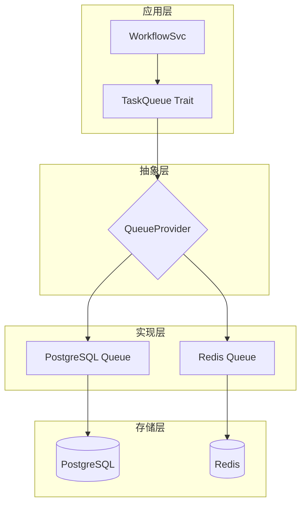
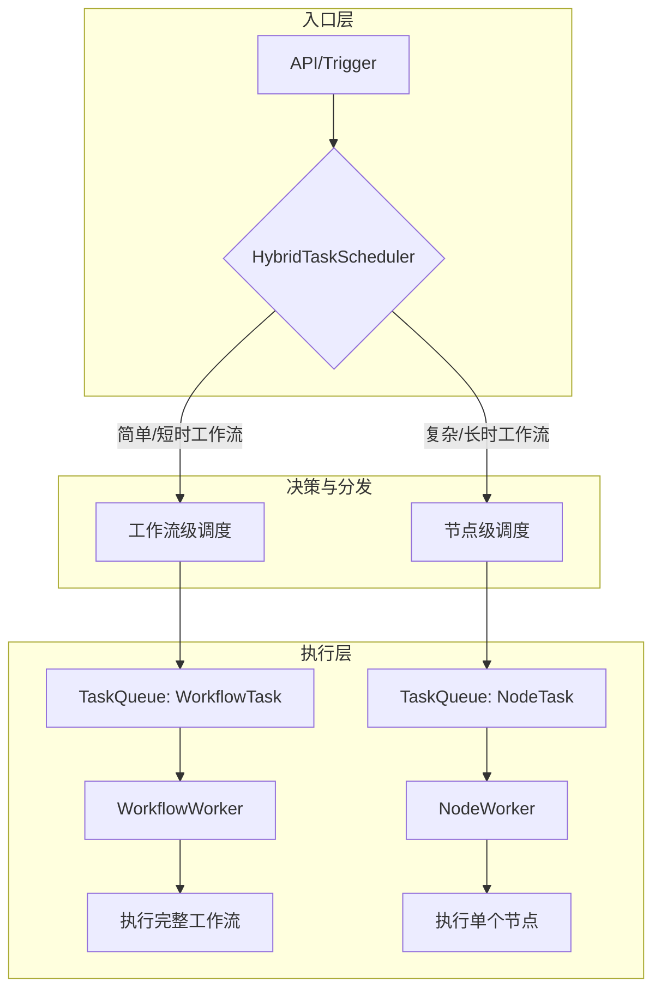
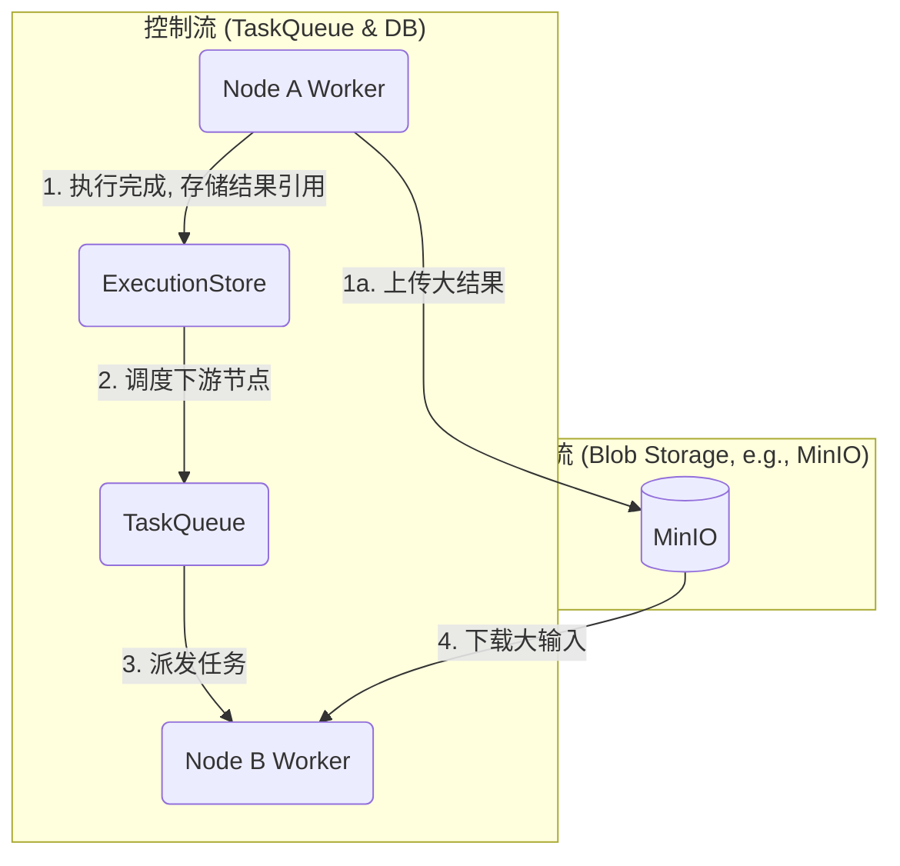

# Hetumind 任务队列技术方案

## 1. 概述

本文档描述了 Hetumind 的异步任务队列系统设计，该系统支持在程序启动时动态选择使用 PostgreSQL 或 Redis
作为后端存储。这种设计提供了灵活性，允许用户根据实际需求和部署环境选择合适的队列实现。

### 1.1 设计目标

- **灵活性**：支持多种后端存储，可在启动时配置
- **一致性**：统一的 API 接口，切换后端不影响业务代码
- **可靠性**：支持任务持久化、重试和故障恢复
- **可扩展**：易于添加新的队列实现
- **高性能**：根据不同场景选择最优实现

### 1.2 架构概览



## 2. 抽象设计

### 2.1 核心 Trait 定义

- [TaskQueue](../../../crates/hetumind/hetumind-core/src/task/task_queue.rs)

### 2.2 Worker Trait 定义

```rust
// crates/hetumind/hetumind/src/infrastructure/queue/worker.rs


```

## 3. PostgreSQL 实现

### 3.1 数据库表设计

- [table task_queue](../../../scripts/software/postgres/sqls/hetumind-ddl.sql)

### 3.2 PostgreSQL 队列实现

- [PostgresQueue](../../../crates/hetumind/hetumind-studio/src/infra/queue/postgres_queue.rs)

### PG 实现设计解析

#### 解析 `FOR UPDATE SKIP LOCKED` 的作用:

- `FOR UPDATE`: 这会对查询选中的行加上一个行级锁。这意味着在当前事务结束前，其他任何试图修改或锁定这些行的事务都必须等待。
- `SKIP LOCKED`: 这是实现高并发的关键。如果一个 `Worker` 在扫描时遇到一个已经被其他 `Worker` 锁定的行（即另一个 `Worker`
  正在处理这个任务），它不会等待锁释放，而是会直接跳过这一行，继续查找下一条未被锁定的行。

**组合效果**：多个 `Worker` 进程可以同时安全地从 `task_queue` 表中拉取任务，而不会发生"惊群效应"（所有 `Worker`
争抢同一个任务）或相互阻塞。每个 `Worker` 都能高效地拿到一批属于自己的、未被其他 `Worker` 染指的任务。

#### 轮询（Polling）机制

每个 Worker 进程会以一个固定的时间间隔（例如，poll_interval 配置的 1 秒）重复执行上述的"扫描与更新"查询。

- 优点：实现简单、可靠，即使在系统负载高时也能稳定工作。
- 缺点：当队列为空时，会产生不必要的数据库查询。在任务到达时，可能存在最多为一个轮询间隔的延迟。

##### （可选）LISTEN/NOTIFY 优化

为了解决轮询的延迟问题，方案中提到了一个可选的优化：使用 PostgreSQL 的 LISTEN/NOTIFY 机制。

- 工作方式：
  1. 入队时通知：当一个新任务被 enqueue 插入到 task_queue 表时，会额外执行一个 NOTIFY 命令，向一个特定的频道（如
     task_queue_channel）发送一个通知。
  2. Worker 监听：空闲的 Worker 进程会执行 LISTEN 命令来监听这个频道。
  3. 立即唤醒：当 Worker 收到通知后，它会立即被唤醒，并打破当前的等待状态，马上执行一次任务扫描，而不是等到下一个轮询周期。

这种轮询 + 通知的混合模式，兼具了两种方式的优点：既有轮询的可靠性作为兜底，又有通知的低延迟特性，使得任务可以被近乎实时地处理。

## 4. 队列提供者工厂

### 4.1 配置结构

- [PostgresQueue](../../../crates/hetumind/hetumind-studio/src/infra/queue/postgres_queue.rs)

### 4.2 队列提供者

- [QueueProvider](../../../crates/hetumind/hetumind-studio/src/infra/queue/queue_provider.rs)

## 5. Worker 实现

### 5.1 通用 Worker 实现

- [GenericWorker](../../../crates/hetumind/hetumind-studio/src/runtime/worker/generic_worker.rs)

### 5.2 任务处理器

- [TaskProcessor](../../../crates/hetumind/hetumind-studio/src/runtime/worker/task_processor.rs)

### 5.3 TaskQueue, TaskProcessor, GenericWorker

这三个组件共同构成了一个完整、健壮的分布式异步任务队列系统。

**TaskQueue** (任务队列抽象)

- 角色: 这是一个 抽象接口 (Trait)，定义了与一个持久化任务队列交互的所有标准操作。
- 核心职责:
  - 解耦: 将上层业务逻辑（如 WorkflowSvc）与底层的队列实现（PostgreSQL 或 Redis）完全分离开。业务代码只需要调用
    queue.enqueue(task)，而无需关心任务是如何存储和传递的。
  - 标准化: 提供了一套标准的队列操作方法，如 enqueue (入队), dequeue (出队), ack (确认完成), nack (确认失败)。
- 关键方法:
  - enqueue: 生产者（如 API 服务）将任务放入队列。
  - dequeue: 消费者（Worker）从队列中拉取待处理的任务。
  - ack/nack: Worker 处理完任务后，向队列报告结果，这对于保证任务"至少执行一次"或"最多执行一次"的语义至关重要。
- 本质: TaskQueue 是连接生产者和消费者的桥梁，它关注的是任务的存储、传递和状态管理。

**TaskProcessor** (任务处理器)

- 角色: 这是一个行为接口 (Trait)，定义了"如何处理一个具体任务"。
- 核心职责:
  - 封装业务逻辑: 它封装了执行一个 QueueTask 所需的全部业务逻辑。例如，WorkflowTaskProcessor 的实现会去加载工作流、调用执行引擎、更新数据库状态等。
  - 专注执行: 它只关心任务的执行过程，不关心任务从哪里来，执行结果通知给谁。
- 关键方法:
  - process: 接收一个 QueueTask，执行它，并返回一个 TaskResult。
- 本质: TaskProcessor 是任务的最终执行者，它包含了具体的"做什么"的逻辑。

**GenericWorker** (通用 Worker)

- 角色: 这是驱动整个任务消费流程的引擎或运行时。
- 核心职责:
  - 生命周期管理: 负责运行一个循环，不断地从 TaskQueue 拉取任务。
  - 流程编排:
    1. 调用 queue.dequeue() 获取任务。
    2. 将获取到的任务交给 TaskProcessor 的 process() 方法去执行。
    3. 根据 process() 的返回结果（成功/失败），调用 queue.ack() 或 queue.nack() 来更新任务在队列中的状态。
  - 健壮性: 管理诸如并发、超时、重试、优雅关闭等运行时细节。
- 本质: GenericWorker 是一个协调者，它将 TaskQueue（任务来源）和 TaskProcessor（任务执行逻辑）粘合在一起，形成一个完整的消费者进程。

## 6. 系统集成

### 6.1 应用启动集成

[`start()`](../../../crates/hetumind/hetumind-studio/src/start.rs) 提供了程序需要的各插件、服务的启动集成。

### 6.2 配置文件示例

```toml
# config/app.toml

# 队列配置 - PostgreSQL
[hetumind.queue]
type = "postgres"
max_pool_size = 10
visibility_timeout = 60  # 秒
enable_listen_notify = true

# 队列配置 - Redis（替代方案）
# [hetumind.queue]
# type = "redis"
# url = "redis://127.0.0.1:6379"
# stream_prefix = "hetumind:queue"
# consumer_group = "hetumind-workers"
# max_retries = 3
# visibility_timeout = 60
# enable_persistence = true

# Worker 配置
[hetumind.worker]
count = 4
batch_size = 5
poll_interval = 1  # 秒
heartbeat_interval = 30  # 秒
max_processing_time = 300  # 秒
```

### 6.3 WorkflowSvc 集成

```rust
// crates/hetumind/hetumind/src/domain/workflow/workflow_svc.rs

impl WorkflowSvc {
    pub async fn execute_workflow(
        &self,
        workflow_id: WorkflowId,
        input: ExecuteWorkflowRequest,
    ) -> Result<ExecutionIdResponse, DataError> {
        // 验证工作流
        let workflow = self.get_workflow(workflow_id).await?;
        if workflow.status != WorkflowStatus::Active {
            return Err(DataError::BizError {
                code: 400,
                msg: "工作流未激活".to_string(),
                detail: None,
            });
        }

        // 创建执行记录
        let execution_id = generate_uuid();
        self.create_execution_record(execution_id, workflow_id).await?;

        // 准备任务
        let task = QueueTask {
            id: Uuid::now_v7().to_string(),
            task_type: "WORKFLOW_EXECUTION".to_string(),
            execution_id,
            workflow_id,
            priority: TaskPriority::Normal,
            payload: serde_json::to_value(WorkflowTaskPayload {
                workflow_snapshot: workflow,
                input_data: input.input_data,
                context: ExecutionContext {
                    user_id: self.ctx.ctx().uid(),
                    correlation_id: execution_id.to_string(),
                },
            })?,
            retry_count: 0,
            max_retries: 3,
            created_at: current_timestamp(),
            scheduled_at: None,
            metadata: HashMap::default(),
        };

        // 获取队列并入队
        let app = Application::global();
        let queue: Arc<dyn TaskQueue> = app.component();
        queue.enqueue(task).await.map_err(|e| {
            DataError::InternalError(e.to_string())
        })?;

        Ok(ExecutionIdResponse { execution_id })
    }
}
```

## 7. 监控和管理

### 7.1 监控 API

```rust
// crates/hetumind/hetumind/src/endpoint/api/v1/queue.rs

pub fn routes() -> Router<Hetumind> {
    Router::new()
        .route("/stats", get(get_queue_stats))
        .route("/tasks/:task_id", get(get_task_status))
        .route("/tasks/:task_id/cancel", post(cancel_task))
        .route("/retry", post(retry_failed_tasks))
        .route("/cleanup", post(cleanup_old_tasks))
}

async fn get_queue_stats(
    State(queue): State<Arc<dyn TaskQueue>>,
) -> WebResult<QueueStats> {
    let stats = queue.get_stats().await?;
    ok_json!(stats)
}
```

### 7.2 CLI 命令

```bash
# 查看队列状态
hetumind-studio queue stats

# 重试失败的任务
hetumind-studio queue retry --execution-id <id>

# 清理过期任务
hetumind-studio queue cleanup --retention 7d
```

## 8. 性能优化建议

### 8.1 PostgreSQL 优化

1. **索引优化**：确保在 status、priority、scheduled_at 上有合适的索引
2. **分区表**：对于大量任务，考虑按时间或状态分区
3. **连接池**：合理配置连接池大小
4. **VACUUM**：定期执行 VACUUM 清理死元组

### 8.2 通用优化

1. **批处理**：合理设置批处理大小
2. **并发控制**：限制同时处理的任务数
3. **超时设置**：合理设置任务超时时间
4. **监控告警**：设置队列积压告警

## 9. 故障处理

### 9.1 故障场景

1. **数据库连接失败**：自动重试，降级处理
2. **任务执行超时**：自动标记失败，可选重试
3. **Worker 崩溃**：其他 Worker 接管任务
4. **队列积压**：自动扩容或告警

### 9.2 恢复机制

```rust
pub struct RecoveryService {
    queue: Arc<dyn TaskQueue>,
    config: RecoveryConfig,
}

impl RecoveryService {
    pub async fn run(&self) {
        let mut interval = interval(self.config.check_interval);

        loop {
            interval.tick().await;

            // 恢复超时任务
            if let Err(e) = self.recover_stale_tasks().await {
                error!("Failed to recover stale tasks: {}", e);
            }

            // 处理延迟任务
            if let Err(e) = self.process_delayed_tasks().await {
                error!("Failed to process delayed tasks: {}", e);
            }

            // 清理过期数据
            if let Err(e) = self.cleanup_old_data().await {
                error!("Failed to cleanup old data: {}", e);
            }
        }
    }
}
```

## 10. 高级分布式调度引擎

在原有工作流级任务队列的基础上，我们设计了一个**高级分布式调度引擎**。该引擎支持**节点级分布式调度**
，将工作流内的每个节点作为独立的任务进行分布式执行，从而提供更细粒度的控制、更高的并发性以及更好的可扩展性。

### 10.1 架构模型：混合调度

为了提供最大的灵活性，系统采用**混合执行模式 (Hybrid Execution Model)**，允许根据工作流的特性自动选择最适合的调度方式。



- **工作流级调度 (Workflow-Level)**：将整个工作流作为一个宏任务，由单个 Worker 从头到尾执行。适合节点少、逻辑简单、执行快速的工作流。
- **节点级调度 (Node-Level)**：将工作流的执行过程拆解，为每一个可执行的节点创建一个独立的微任务，由多个 Worker
  并行处理。适合节点多、依赖关系复杂、包含长耗时或高并发节点的复杂工作流。
- **混合调度器 (HybridTaskScheduler)**：作为统一的调度入口，它会根据工作流的元数据（如节点数量、预估执行时间、特定标签）或系统配置，智能决策采用哪种调度模式。

### 10.2 核心组件

- **`HybridTaskScheduler`**：决策者。决定一个工作流是作为一个整体执行还是拆分为节点任务执行。
- **`DistributedTaskScheduler`**：节点级调度器。负责节点任务的生命周期管理，包括构建执行图、调度起始节点、处理节点依赖关系、以及在节点完成后触发下游节点。
- **`NodeTaskProcessor`**：节点任务执行器。运行在 Worker 中，负责处理 `NodeTask`，是单个节点业务逻辑的实际执行者。
- **`ExecutionStore`**：分布式状态存储。负责持久化工作流和所有节点的执行状态、输入输出数据（或其引用）以及依赖关系图。为实现高并发读写和不同数据的访问模式，它采用分层存储设计。

### 10.3 核心数据模型

```rust
// 节点执行任务负载
#[derive(Debug, Clone, Serialize, Deserialize)]
pub struct NodeTaskPayload {
    pub execution_id: ExecutionId,
    pub workflow_id: WorkflowId,
    pub node: WorkflowNode,
    pub input_data: Vec<ExecutionData>, // 对于大型数据，这里存储的是对象存储的引用
    pub context: ExecutionContext,
    pub workflow_snapshot: Arc<Workflow>, // 使用 Arc 避免频繁克隆
}

// 节点任务结果
#[derive(Debug, Clone, Serialize, Deserialize)]
pub struct NodeTaskResult {
    pub node_name: NodeId,
    pub execution_id: ExecutionId,
    pub output_data: Vec<ExecutionData>, // 同样，可能是对象引用
    pub status: NodeExecutionStatus,
    pub error: Option<String>,
}

#[derive(Debug, Clone, Serialize, Deserialize, PartialEq)]
pub enum NodeExecutionStatus {
    Pending,
    Running,
    Success,
    Failed,
    Cancelled,
    Skipped,
    Parked, // 任务因依赖未满足而进入等待室
}
```

### 10.4 调度与执行生命周期

#### 1. 开始执行

`HybridTaskScheduler` 接收到执行请求后，根据策略决定使用节点级调度。它调用 `DistributedTaskScheduler` 开始执行。

#### 2. 调度起始节点

`DistributedTaskScheduler` 构建工作流的拓扑图，找出所有没有入度（依赖）的起始节点，为它们创建 `NodeTask` 并推入 `TaskQueue`。

#### 3. Worker 获取并处理任务 (`NodeTaskProcessor`)

这是系统的核心环节，集成了"等待室"机制以优化依赖处理。

1. **获取任务**：`NodeWorker` 从 `TaskQueue` 中获取一个 `NodeTask`。
2. **检查依赖**：`NodeTaskProcessor` 检查该任务的所有父级依赖节点是否都已成功执行完毕。
3. **进入等待室 (Park)**：
   - 如果依赖未满足，任务不会被立即拒绝或放回主队列。而是被放入一个专门的"等待室"（例如 Redis `ZSET`），并设置一个较短的唤醒时间戳。
   - Worker 立即返回一个 `deferred` 确认，以便可以继续处理其他任务，避免无效的轮询和等待。
4. **执行业务逻辑**：
   - 如果依赖满足，`NodeTaskProcessor` 会更新节点状态为 `Running`，并调用 `NodeRegistry` 中对应的节点执行器 (`Executor`)
     来执行业务逻辑。
5. **处理执行结果**：
   - **成功**：将执行结果（或其在对象存储中的引用）保存到 `ExecutionStore`，更新节点状态为 `Success`。
   - **失败**：如果任务失败且未达到重试上限，则根据重试策略（如指数退避）重新入队。如果达到上限，则移入 **死信队列 (DLQ)**。
6. **唤醒与触发**：节点成功执行后，`NodeTaskProcessor` 调用 `DistributedTaskScheduler` 的 `trigger_downstream_nodes`
   方法。此方法不仅会调度所有直接下游节点，还会去"等待室"检查并"唤醒"那些正在等待此节点作为依赖项的任务，将它们重新推回主任务队列。

这种 **"依赖检查 -> 等待室 -> 事件唤醒"** 的闭环机制，结合了推拉模式的优点，极大地减少了因依赖等待而产生的无效队列轮询。

### 10.5 数据流与控制流分离

当节点的输入输出是大型文件或数据块时，将其直接通过任务队列传递会带来巨大性能瓶颈。方案采用**数据流和控制流分离**的模式来解决此问题。



- **控制流**：通过 `TaskQueue` 和 `ExecutionStore` (Redis/Postgres) 传递，只包含轻量级的元数据、状态和数据的**对象引用**。
- **数据流**：通过专用的**大对象存储 (Blob Storage)** 服务（如 MinIO, S3）传递。Worker 在执行需要大数据的任务前，根据引用自行下载数据；执行完毕后，再将结果上传。

### 10.6 分层状态存储 (`ExecutionStore`)

为应对不同数据的访问模式，`ExecutionStore` 采用分层设计：

- **热数据 (Hot Data)**：存储在 **Redis** 中，用于存放频繁更新、生命周期短的状态信息。例如：
  - 节点的当前运行状态 (`RUNNING`, `PARKED`)
  - 等待室中的任务集合
  - 用于判断工作流是否完成的原子计数器
- **冷数据 (Cold Data)**：存储在 **PostgreSQL** 中，用于归档最终的、不可变的执行结果、历史日志和工作流快照，便于持久化存储和复杂的分析查询。

### 10.7 可靠性与容错性设计

- **死信队列 (Dead-Letter Queue, DLQ)**：对于达到最大重试次数后仍然失败的任务，会将其所有上下文信息移入一个专门的"
  死信队列"。这为后续的人工介入、失败分析和手动恢复提供了保障。
- **精细化重试策略**：支持在节点定义中配置复杂的重试策略，而不仅仅是固定次数。例如，`exponential_backoff`（指数退避）。
- **节点级熔断器 (Circuit Breaker)**：对于调用外部服务等不稳定的节点，如果连续失败多次，可以触发熔断。在一段时间内，所有新的同类任务都会被立即标记为失败或跳过，避免无谓的重试，保护下游系统。
- **Worker 优雅关闭**：Worker 进程可以监听到终止信号，并确保当前正在处理的任务执行完毕后再退出，防止任务执行中断。

### 10.8 高可用性 (High Availability)

为确保生产环境的稳定运行，系统的各个组件都应考虑高可用部署：

- **存储后端**：任务队列和状态存储的后端必须是高可用的集群。
  - **PostgreSQL**: 使用主从复制、Patroni 或云厂商提供的 HA 数据库服务。
  - **Redis**: 使用 Redis Sentinel 或 Redis Cluster 模式。
- **调度器与恢复服务**：系统中存在一些需要全局协调的单例服务（如 `RecoveryService`）。这些服务应以多实例方式部署，并通过\* \*领导者选举 (Leader Election)\*\* 机制（如基于 Etcd, Zookeeper 或 Redis 实现）选举出一个 `active` 实例来执行任务，其他实例作为
  `standby`。一旦 `active` 实例失效，`standby` 实例可以快速接管，从而消除单点故障。

### 10.9 统一配置示例

以下是一份包含了所有调度模式和高级功能的统一配置文件示例：

```toml
# config/app.toml

# ---- 队列与存储配置 ----
[hetumind.queue]
# 支持 'postgres' 或 'redis'
type = "redis"
# Redis 连接 URL
url = "redis://127.0.0.1:6379"
# PostgreSQL 连接池大小 (当 type = "postgres" 时生效)
# max_pool_size = 20

[hetumind.blob_storage]
# 支持 'minio', 's3' 或 'local'
type = "minio"
endpoint = "http://127.0.0.1:9000"
access_key = "minioadmin"
secret_key = "minioadmin"
bucket = "guixuflow"

# ---- Worker 配置 ----
[hetumind.worker]
# Worker 进程/线程数量
count = 10
# 启用节点处理器
node_processor_enabled = true
# 启用工作流处理器
workflow_processor_enabled = true
# 每个 Worker 一次拉取的任务数量
batch_size = 5
# 队列为空时轮询间隔
poll_interval = "1s"

# ---- 调度器配置 ----
[hetumind.scheduler]
# 混合调度器配置
[hetumind.scheduler.hybrid]
# 默认执行模式: 'hybrid', 'workflow_level', 'node_level'
default_mode = "hybrid"
# 节点数超过此阈值，优先使用 node_level 调度
workflow_level_threshold = 10
# 预估执行时间超过此阈值，优先使用 node_level 调度
node_level_threshold = "5m"

# 分布式节点调度配置
[hetumind.scheduler.distributed]
# 节点任务优先级策略: 'by_node_type', 'by_dependency_depth'
priority_strategy = "by_node_type"
# 依赖检查重试间隔（当任务在等待室时）
dependency_check_interval = "1s"
# 默认最大重试次数
max_retries = 3
# 默认任务超时时间
default_timeout = "10m"
```

## 11. 总结

本方案提供了一个从简单到复杂的、完整且可演进的分布式任务队列系统。其核心优势在于：

1. **双层调度模型与混合策略**：既能简单高效地处理普通工作流，又能通过节点级调度驾驭高度复杂的分布式业务流程。
2. **健壮的依赖处理**：通过"等待室+事件唤醒"机制，优雅地解决了分布式环境中的任务依赖问题。
3. **数据与控制分离**：通过集成大对象存储，为处理大数据负载提供了高性能和高可扩展性的解决方案。
4. **全方位可靠性**：内置了死信队列、精细化重试、熔断器和高可用部署模式，确保了生产环境的稳定。

通过这种设计，Hetumind 不仅能满足当前的需求，也为未来的功能扩展（如分布式循环、动态子工作流、更智能的调度策略等）打下了坚实的基础。
