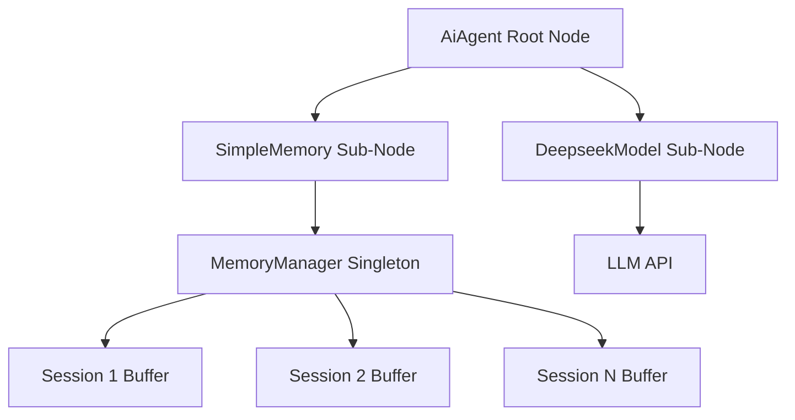
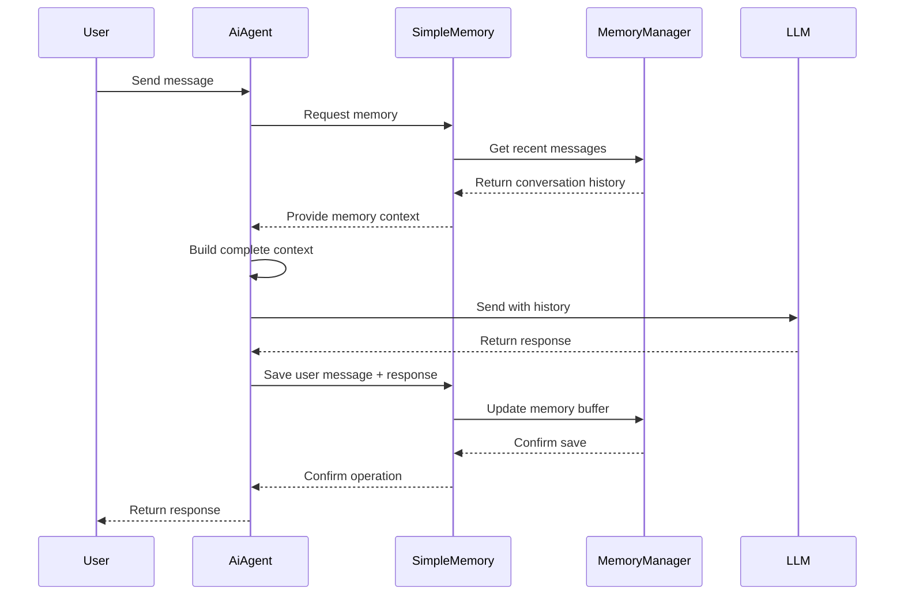

# SimpleMemoryNode Implementation Documentation

## Overview

The **SimpleMemoryNode** is a comprehensive in-memory storage solution designed for AI workflows in the hetumind project. It provides sliding window memory management with session isolation and automatic cleanup, following the architectural patterns established by n8n's Simple Memory node.

## Architecture

### Core Components

1. **SimpleMemoryNode** (`mod.rs`) - Main node entry point and registration
2. **MemoryManager** (`memory_manager.rs`) - Singleton memory manager with global state
3. **SimpleMemoryV1** (`simple_memory_v1.rs`) - V1 implementation of the memory node
4. **Memory Configuration** (`memory_config.rs`) - Data structures and configuration

### Key Features

- **Sliding Window Memory**: Maintains fixed-size conversation history using `context_window_length`
- **Session Isolation**: Each workflow-session combination maintains separate memory spaces
- **Singleton Pattern**: Global memory manager with automatic cleanup of expired buffers
- **Workflow Scoping**: Memory is isolated to specific workflows using `workflowId__sessionId` pattern
- **Automatic Cleanup**: Expired memory buffers (older than `buffer_expiry_minutes`) are automatically cleared
- **Thread-Safe**: Uses `RwLock` for concurrent access protection
- **Rust Integration**: Follows hetumind project patterns and integrates with existing node architecture

## Usage Pattern

### As a Sub-Node

SimpleMemoryNode is designed as a **sub-node** that provides memory services to root nodes like AiAgent:



### Integration with AiAgent

The AiAgent root node connects to SimpleMemory through `ConnectionKind::AiMemory`:

1. **Memory Retrieval**: AiAgent gets conversation history from SimpleMemory
2. **Context Building**: History is combined with current user input
3. **LLM Execution**: Complete context is sent to LLM model
4. **Memory Update**: LLM response is saved back to SimpleMemory

## Configuration Options

### Basic Configuration

```rust
pub struct SimpleMemoryConfig {
    pub session_id_type: SessionIdType,
    pub custom_session_key: Option<String>,
    pub context_window_length: usize,
    pub input_key: String,
    pub memory_key: String,
    pub output_key: String,
    pub return_messages: bool,
    pub buffer_expiry_minutes: Option<u64>,
}
```

### Session ID Types

- **FromInput**: Extract session ID from input data (default)
- **CustomKey**: Use custom expression-based session key

### Default Values

- `context_window_length`: 5 messages
- `buffer_expiry_minutes`: 60 minutes
- `input_key`: "input"
- `memory_key`: "chat_history"
- `output_key`: "output"

## Data Flow

### Memory Storage Flow



### Memory Key Structure

```
{workflowId}__{session_id}
```

Examples:
- `workflow_123__session_456`
- `chat_bot_workflow__user_session_789`

## Memory Management

### Sliding Window Behavior

The sliding window maintains only the most recent N messages:

```rust
// With context_window_length = 3
// Original: [msg1, msg2, msg3, msg4, msg5]
// After sliding window: [msg3, msg4, msg5]
```

### Automatic Cleanup

- **Frequency**: Every 5 minutes
- **Criteria**: Buffers older than `buffer_expiry_minutes` (default 60 minutes)
- **Process**: Stale buffers are removed from memory
- **Logging**: Cleanup operations are logged for monitoring

### Session Isolation

- Each `workflowId__sessionId` combination has isolated memory
- No cross-session data contamination
- Concurrent sessions supported within same workflow

## Implementation Details

### Memory Manager Singleton

```rust
impl MemoryManager {
    pub fn instance() -> Arc<Self> {
        unsafe {
            INIT.call_once(|| {
                let manager = Arc::new(Self::new());
                MEMORY_MANAGER = Some(manager.clone());
                Self::start_cleanup_task(manager.clone());
            });
            MEMORY_MANAGER.as_ref().unwrap().clone()
        }
    }
}
```

### Thread Safety

- Uses `RwLock<HashMap<String, MemoryBufferEntry>>` for concurrent access
- Read operations can proceed simultaneously
- Write operations are serialized for data consistency

### Error Handling

- Comprehensive error propagation through `Result<T, MemoryOperationResult>`
- Detailed error logging with context
- Graceful degradation when memory operations fail

## Testing Strategy

### Unit Tests

1. **Singleton Pattern**: Verify only one instance exists
2. **Memory Operations**: Test save, retrieve, clear operations
3. **Session Isolation**: Verify data separation between sessions
4. **Sliding Window**: Test message limit enforcement
5. **Configuration Validation**: Test invalid configuration handling

### Integration Tests

1. **AiAgent Integration**: Test memory flow with AiAgent root node
2. **Concurrent Access**: Test multiple simultaneous sessions
3. **Memory Cleanup**: Test automatic buffer expiration
4. **Error Recovery**: Test behavior under error conditions

## Performance Characteristics

### Memory Usage

- **Fixed per Buffer**: Each buffer uses `O(context_window_length)` memory
- **Cleanup Overhead**: Minimal impact with periodic background cleanup
- **Concurrent Access**: Efficient with RwLock allowing multiple readers

### Scalability

- **Session Limit**: Practically limited by available memory
- **Workflow Isolation**: Efficient hashmap-based lookup
- **Cleanup Frequency**: Configurable cleanup interval (default 5 minutes)

## Best Practices

### Configuration Guidelines

1. **Context Window Size**: Set based on LLM token limits
2. **Expiry Time**: Balance memory usage vs. session persistence needs
3. **Session Management**: Use consistent session ID strategies

### Integration Patterns

1. **Memory-First Design**: Always check memory before external API calls
2. **Error Handling**: Implement graceful fallback when memory fails
3. **Monitoring**: Track memory usage and cleanup statistics

### Performance Optimization

1. **Batch Operations**: Save multiple messages together when possible
2. **Selective Retrieval**: Only retrieve necessary message count
3. **Background Cleanup**: Don't block main workflow for cleanup

## Future Enhancements

### Planned Features

1. **External Storage**: Integration with Redis, PostgreSQL, etc.
2. **Vector Memory**: Semantic search capabilities
3. **Memory Compression**: Efficient storage of long conversations
4. **Memory Analytics**: Usage statistics and insights
5. **Memory Export**: Export/import memory between sessions

### Extensibility

- Plugin architecture for different memory backends
- Configurable cleanup strategies
- Custom memory serialization formats
- Integration with external AI memory systems

## Comparison with n8n Implementation

| Feature | n8n Simple Memory | hetumind SimpleMemoryNode |
|---------|-------------------|---------------------------|
| **Language** | TypeScript | Rust |
| **Storage** | In-memory Map | Singleton with RwLock |
| **Session Management** | Basic | Advanced with workflow isolation |
| **Cleanup** | Manual | Automatic background cleanup |
| **Thread Safety** | Single-threaded | Multi-threaded with RwLock |
| **Error Handling** | Basic | Comprehensive with detailed logging |
| **Integration** | Direct node connections | Sub-node pattern with root nodes |
| **Configuration** | Basic | Advanced with validation |
| **Performance** | Good | Excellent with Rust performance |

## Conclusion

The SimpleMemoryNode provides a robust, scalable, and performant memory management solution for AI workflows in hetumind. It successfully translates the n8n Simple Memory concept to Rust while adding significant improvements in:

- **Performance**: Rust's memory safety and performance
- **Concurrency**: Multi-threaded support with proper synchronization
- **Reliability**: Comprehensive error handling and automatic cleanup
- **Integration**: Seamless integration with hetumind's node architecture
- **Extensibility**: Foundation for future memory enhancements

The implementation demonstrates thoughtful design decisions around simplicity, performance, and maintainability, making it an excellent foundation for AI workflow memory management in production environments.
