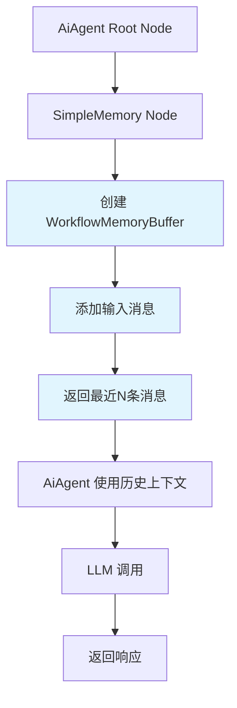

# SimpleMemoryNode 重新设计文档

## 设计原则变更

### 原始设计问题
您的反馈指出了原设计的关键问题：
- **过度复杂化**：全局 MemoryManager 单例模式对于聊天历史管理来说过于复杂
- **生命周期不匹配**：聊天历史应该跟随工作流执行，而不是全局状态
- **状态管理复杂**：自动清理、过期时间等对于短期工作流执行来说是不必要的

### 新的设计原则
- **简单性优先**：移除不必要的全局状态管理
- **工作流范围**：内存管理限制在单个工作流执行范围内
- **无状态设计**：每次执行都是独立的，不依赖持久化状态

## 重新设计的架构

### 1. 移除全局 MemoryManager
```rust
// ❌ 原设计 - 全局单例
static mut MEMORY_MANAGER: Option<Arc<MemoryManager>> = None;

// ✅ 新设计 - 无全局状态
pub struct WorkflowMemoryBuffer {
    pub messages: VecDeque<ConversationMessage>,
    pub session_id: String,
    pub last_updated: DateTime<Utc>,
}
```

### 2. 工作流范围的内存管理
```rust
// 新设计：每个工作流执行维护自己的内存
impl WorkflowMemoryBuffer {
    pub fn new(session_id: String) -> Self { ... }
    pub fn add_message(&mut self, message: ConversationMessage) { ... }
    pub fn get_recent_messages(&self, count: usize) -> Vec<ConversationMessage> { ... }
}
```

### 3. 简化的数据流


## 核心组件变更

### 1. SimpleMemoryConfig 简化
```rust
// 移除了复杂的配置项
pub struct SimpleMemoryConfig {
    pub session_id_type: SessionIdType,
    pub custom_session_key: Option<String>,
    pub context_window_length: usize,  // 核心配置
    // 移除：buffer_expiry_minutes, 复杂的过期管理
    // 移除：input_key, memory_key, output_key 不必要的键名配置
}
```

### 2. WorkflowMemoryBuffer 替代 MemoryBufferEntry
```rust
// 新设计：轻量级缓冲区
pub struct WorkflowMemoryBuffer {
    pub messages: VecDeque<ConversationMessage>,
    pub session_id: String,
    pub last_updated: DateTime<Utc>,
}

// 移除原设计的复杂性：
// - created_at 和 last_accessed 时间戳
// - workflow_id 冗余（已经在工作流上下文中）
// - is_expired 过期检查逻辑
```

### 3. SimpleMemoryAccessor 替代 SimpleMemoryWrapper
```rust
// 新设计：只读访问器
pub struct SimpleMemoryAccessor {
    pub session_id: String,
    pub workflow_id: String,
    pub chat_history: Vec<ConversationMessage>,
    pub stats: MemoryStats,
}

impl SimpleMemoryAccessor {
    pub fn get_recent_messages(&self, count: usize) -> Vec<&ConversationMessage> { ... }
    pub fn get_all_messages(&self) -> &Vec<ConversationMessage> { ... }
    // 移除：save_messages, clear 等修改操作
}
```

## 工作流执行模式

### 内存生命周期
1. **工作流开始** → SimpleMemoryNode 创建 WorkflowMemoryBuffer
2. **消息处理** → 缓冲区存储消息，应用滑动窗口
3. **数据提供** → SimpleMemoryAccessor 提供只读访问
4. **工作流结束** → 内存自动释放，无需清理

### 会话隔离
```
工作流执行 #1: Session A → Buffer A → Accessor A
工作流执行 #2: Session B → Buffer B → Accessor B
工作流执行 #3: Session A → Buffer A' → Accessor A'
```
每个工作流执行都有独立的内存空间，即使会话ID相同。

## 简化的集成流程

### AiAgent 集成变更
```rust
// 旧设计：复杂的全局内存管理
async fn get_memory_wrapper(&self) -> Result<Option<SimpleMemoryWrapper>, NodeExecutionError> {
    // 查找全局 MemoryManager
    // 创建或获取缓冲区
    // 处理并发和清理
}

// 新设计：简单的执行数据访问
async fn get_memory_accessor(&self) -> Result<Option<SimpleMemoryAccessor>, NodeExecutionError> {
    // 执行 SimpleMemoryNode
    // 从执行数据创建访问器
    // 返回只读视图
}
```

### 内存访问模式
```rust
// 新设计：只读访问，无状态修改
let accessor = memory_accessor.unwrap();
let recent_messages = accessor.get_recent_messages(5);

// 注意：不能直接保存新消息到内存
// 新消息会在下一次 SimpleMemoryNode 执行时处理
```

## 优势对比

| 特性 | 原设计 | 新设计 |
|------|--------|--------|
| **复杂度** | 高（全局单例、清理任务、过期管理） | 低（简单数据结构） |
| **内存占用** | 高（持久化所有会话） | 低（仅当前工作流） |
| **并发安全** | 复杂（需要全局锁） | 简单（工作流隔离） |
| **生命周期** | 复杂（需要手动清理） | 简单（跟随工作流） |
| **调试难度** | 高（全局状态难以追踪） | 低（局部状态易调试） |
| **测试复杂度** | 高（需要模拟全局状态） | 低（独立单元测试） |

## 使用示例

### 基本工作流设置
```rust
// 1. AiAgent 连接到 SimpleMemory (ConnectionKind::AiMemory)
// 2. AiAgent 连接到 DeepseekModel (ConnectionKind::AiLM)

// 执行流程：
// SimpleMemory → 读取输入消息 → 存储到缓冲区 → 返回历史消息
// AiAgent → 接收历史消息 → 构建 LLM 上下文 → 调用 LLM → 返回响应
```

### 内存数据格式
```json
{
  "session_id": "user_session_123",
  "workflow_id": "workflow_456",
  "chat_history": [
    {
      "role": "user",
      "content": "Hello",
      "timestamp": "2024-01-01T00:00:00Z"
    },
    {
      "role": "assistant",
      "content": "Hi there!",
      "timestamp": "2024-01-01T00:00:01Z"
    }
  ],
  "stats": {
    "total_messages": 2,
    "context_window_length": 5
  }
}
```

## 未来扩展方向

### 短期改进
1. **工作流执行上下文集成**：在工作流上下文中实现真正的内存存储
2. **消息持久化选项**：可选地将重要消息保存到外部存储
3. **更丰富的消息类型**：支持图片、文件等复杂消息类型

### 长期规划
1. **分布式内存支持**：在多节点环境中共享内存状态
2. **向量搜索集成**：基于语义搜索的历史消息检索
3. **智能压缩**：自动总结长对话以节省上下文空间

## 总结

这个重新设计完全符合您的建议：
- **移除了不必要的全局状态管理**
- **简化了内存管理的复杂度**
- **使内存管理跟随工作流执行的生命周期**
- **保持了原有的核心功能（滑动窗口、会话隔离）**

新设计更简单、更可靠、更符合工作流执行的自然模式，同时仍然为 AI 聊天机器人提供了所需的记忆功能。